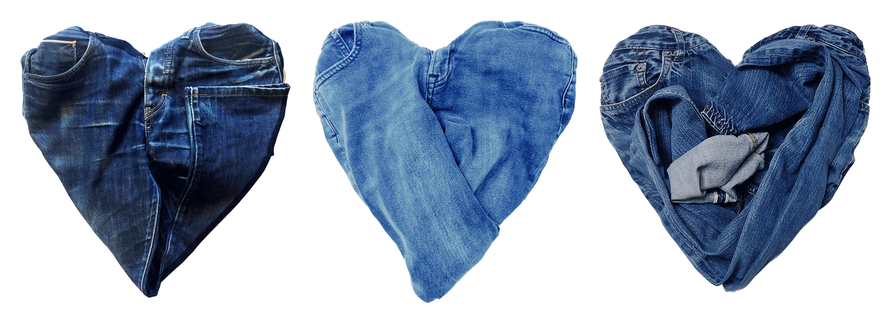

# data-wrangling-project


 

## 📌 Purpose  
This project focuses on collecting, cleaning, and transforming **jeans product data** from major retail brands — **H&M, Zara, and APC**.  
The goal is to demonstrate strong **data wrangling, web scraping, cleaning, and exploratory analysis** skills using Python.

---

## 🎯 Objectives  
- Scrape jeans data for **Men, Women, and Kids** from H&M, Zara, and APC.  
- Clean and preprocess raw scraped HTML data.  
- Normalize columns (price, color, category, currency, product names).  
- Remove duplicates and handle missing values.  
- Transform the cleaned data into an analysis-ready dataset.  
- Generate visual insights (price distribution, gender mix, colors, brand comparison).  
- Present the entire workflow in a clear and structured portfolio format.

---

## 📂 Data Overview  

### **Sources Scraped**
| Brand | Categories Scraped |
|-------|---------------------|
| **H&M** | Men, Women, Kids (9–14y) |
| **Zara** | Women / Men (depending on available products) |
| **APC** | Unisex jeans product listings |

### **Data Fields Extracted**
- Product Name  
- Brand  
- Category (Men / Women / Kids)  
- Price (converted to float)  
- Currency  
- Color   

### **Cleaning Operations Performed**
- Converted price from string → numeric  
- Removed “€” or “USD” symbols & commas  
- Extracted colors uniformly (e.g., "denim blue", "dark wash")  
- Standardized brand names  
- Normalized gender/category tags  
- Filled missing values  
- Removed duplicates  
- Removed HTML artifacts and extra whitespace  

---

## 🔗 Dataset Sources  

### **H&M**
- Women’s Jeans → https://www2.hm.com/de_de/damen/produkte/jeans.html  
- Men’s Jeans → https://www2.hm.com/de_de/herren/produkte/jeans.html  
- Kids Jeans (9–14y) → https://www2.hm.com/de_de/kinder/9-14j/kleidung/jeans.html  

### **Zara**
- Women’s Jeans → https://www.zara.com/de/en/woman-jeans-l1119.html  

### **APC**
- APC Jeans → https://www.apcstore.com/

---

## 🎥 Presentation Link  
👉 **Click here to view the project presentation:**  
**https://www.canva.com/design/DAGvSpyBZro/amVtELNRrOtlXYbNiNKjzg/edit** 

---

## 🛠️ Setup Instructions  

### 1. Clone the Repository
```bash
git clone https://github.com/yourusername/data-wrangling-project.git
cd data-wrangling-project
